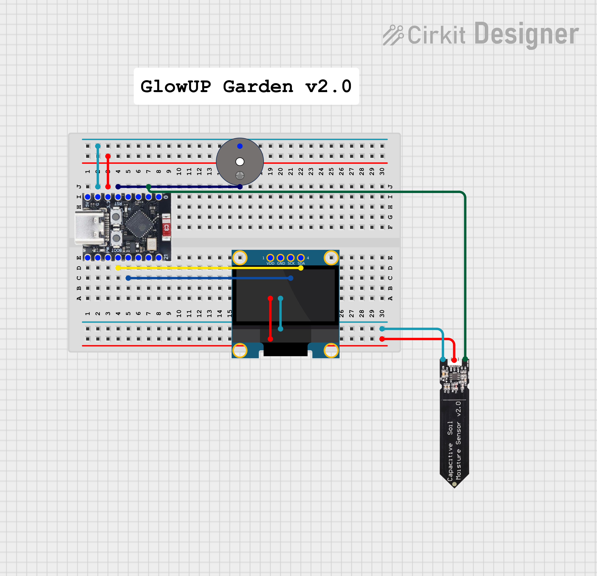

# GlowUP Plant

Projeto didático com ESP32-C3, sensor capacitivo de umidade do solo, display OLED com expressões, buzzer, Wi-Fi, Google Sheets, Looker Studio e diagnóstico por IA com Gemini.

## Versão atual

A versão atual de rodagem está no arquivo:

`GlowUP_plant.ino`

## Configuração das credenciais

Este projeto usa um arquivo `secrets.h` para armazenar dados sensíveis, como nome da rede Wi-Fi, senha e URL do Google Apps Script.

O arquivo `secrets.h` não é enviado ao GitHub.

O repositório inclui apenas o modelo:

`fake_secrets.h`

### Configuração automática

Na raiz do projeto, execute:

```bash
./setup_secrets.sh
```

Depois edite o arquivo `secrets.h` criado e preencha com seus dados reais.

<h2>Diagrama de montagem</h2>

<p>Clique na imagem para abrir o projeto no Cirkit Designer.</p>

<a href="https://app.cirkitdesigner.com/project/ce25b819-92e0-4bf0-b35e-8e1f78cec135" target="_blank">
  
</a>
